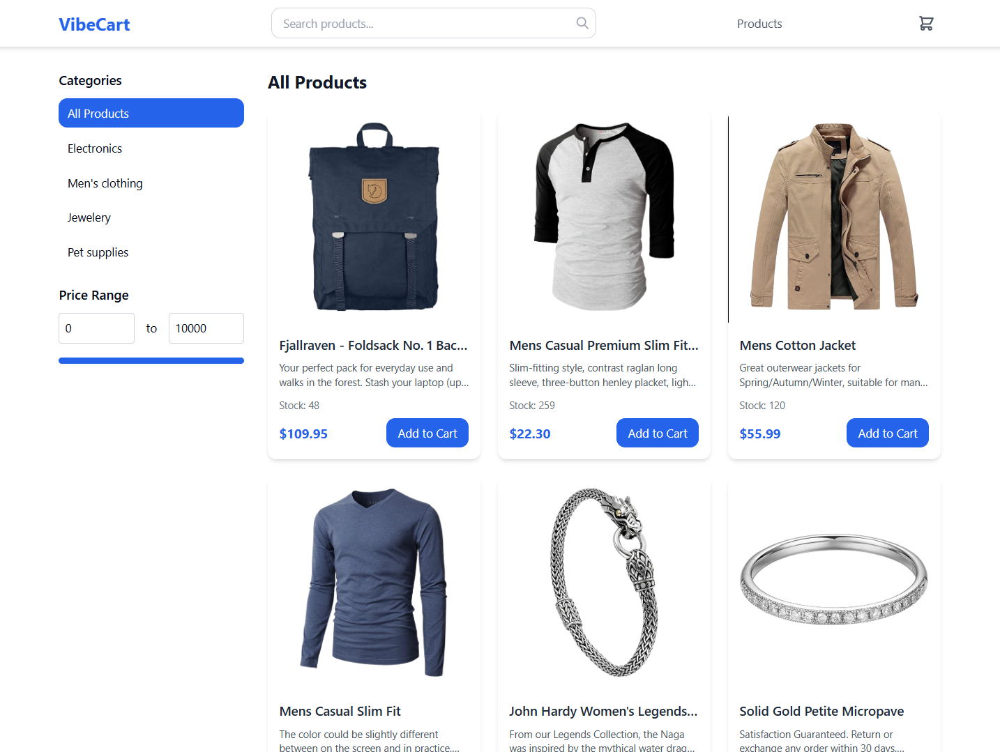
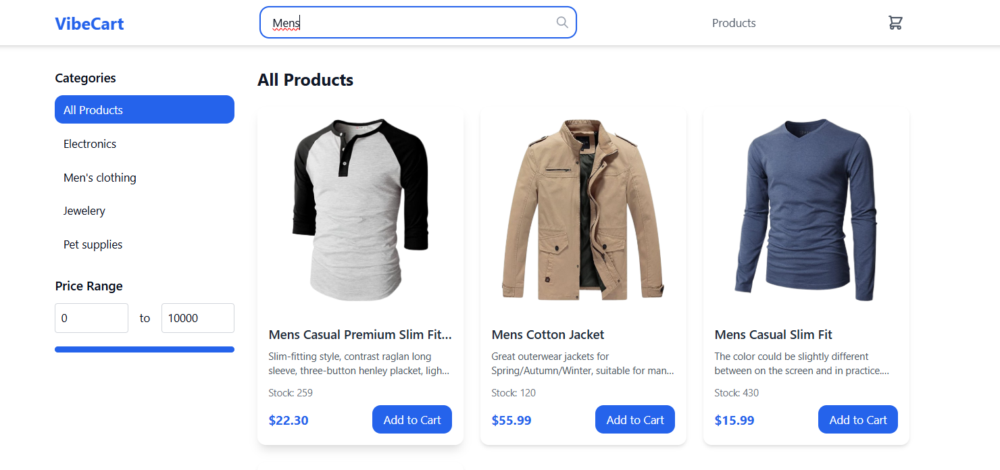
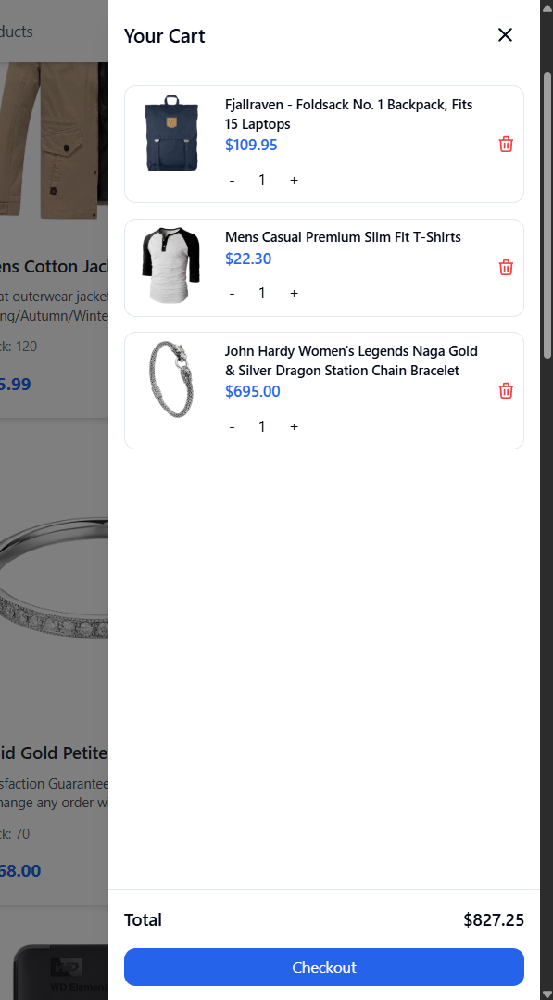
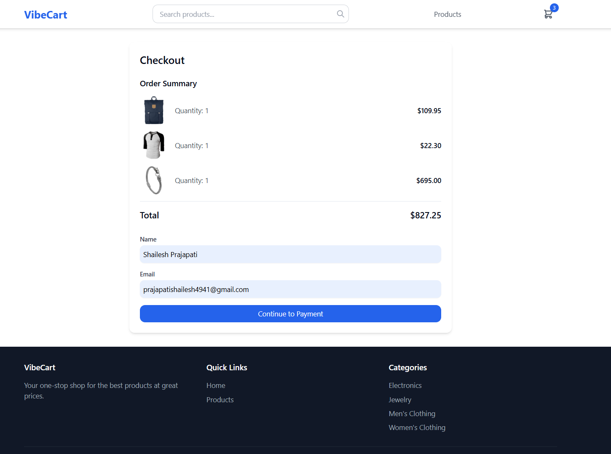
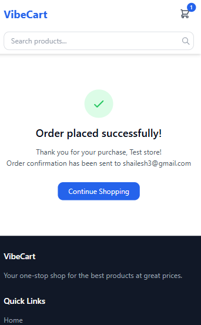

# VibeCart — Mock E-Commerce Cart App

A fully responsive, full-stack **mock e-commerce cart application** built as part of the **Vibe Commerce Internship Assignment**.  
This project demonstrates realistic shopping cart, checkout, and user flows — combining modern UI, backend APIs, and persistent data handling.

---

## 🎥 Demo Video
🎬 [Watch the Demo](https://drive.google.com/file/d/1D6fkYuKmg2s5ZtWki_xhBJ7vrO54Mk7P/view?t=4)  

---

## 🧠 Architecture Overview

Frontend (React + Tailwind + shadcn/ui)
↓ Axios + Cookies
Backend (Node.js + Express)
↓
Database (MongoDB Atlas)
---

## 💻 API Endpoints

| Method | Endpoint | Description |
|:--------:|:-----------|:-------------|
| `GET` | `/api/products` | Fetch product list (or from FakeStore API) |
| `GET` | `/api/cart/items` | Retrieve current cart for user/guest |
| `POST` | `/api/cart/items` | Add item to cart |
| `DELETE` | `/api/cart/items/:id` | Remove item from cart |
| `POST` | `/api/checkout` | Mock checkout — returns fake receipt |

---

## 🧠 Frontend Pages & Functionality

| Page | Description |
|------|--------------|
| **Products** | List + filters (category, price, search) + infinite scroll + Add to Cart |
| **Cart** | Drawer/Modal with item list, qty controls, remove & total calculation |
| **Checkout** | Login/Signup popup → Payment simulation → Order receipt |
| **Order Success** | Full-screen modal with animation & order details |

---

## 🖼️ UI Gallery

### 🏠 Home & Product Pages
| Products Page | Filter by Category | Search Product |
|:--:|:--:|:--:|
|  |  |  |

---

### 📱 Mobile Experience
| Product Page (Mobile) | Filter Drawer (Mobile) | Cart (Mobile) |
|:--:|:--:|:--:|
|  |  |  |

---

### 💻 Desktop Views
| Cart (Desktop) | Checkout (Desktop) |
|:--:|:--:|
|  |  |

---

### 💳 Checkout Flow
| Checkout (Mobile) | Payment Processing | Toast Notification |
|:--:|:--:|:--:|
|  |  |  |

---

### ✅ Order Confirmation
| Order Placed (Desktop) | Order Placed (Mobile) |
|:--:|:--:|
|  |  |

👨‍💻 Developer
Name: Shailesh Prajapati
📩 Email:  prajapatishailesh4941@gmail.com
🐙 GitHub: https://github.com/Shailesh7026/

“Built with ❤️ using React, Node, and MongoDB ”